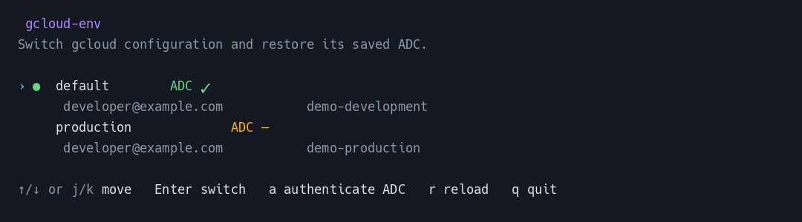

# gcloud-env

[](https://github.com/minibota/gcloud-env/actions/workflows/ci.yml)
[](https://github.com/minibota/gcloud-env/releases/latest)

A tiny Go TUI for switching between existing Google Cloud CLI configurations **and their matching Application Default Credentials (ADC)**.

`gcloud` named configurations solve only part of the problem: they switch the active CLI account/project, while tools such as Cloud SQL Auth Proxy may authenticate with ADC from `~/.config/gcloud/application_default_credentials.json`. `gcloud-env` keeps one saved ADC file per gcloud configuration and restores the right one when you switch.

## What it does



Actual TUI captured with isolated demo configurations and placeholder identities.

- Detects existing configurations using `gcloud config configurations list`.
- Shows each configuration's account and project.
- Marks the currently active configuration.
- Switches the active gcloud configuration with `Enter`.
- Restores the ADC previously saved for that configuration.
- Runs `gcloud auth application-default login` with `a` and saves the resulting ADC for future switches.
- Also supports non-interactive `use` and `status` commands.
- Has no Go runtime dependencies: the built executable is a single binary.

## Requirements

- Linux or macOS terminal.
- Google Cloud CLI (`gcloud`) installed and available in `PATH`.
- `stty` available (standard on Linux/macOS).
- Go 1.23+ only if building from source.

## Install a release

Download a prebuilt archive from [Releases](https://github.com/minibota/gcloud-env/releases/latest):

| System | Architecture | Archive suffix |
| --- | --- | --- |
| Linux | x86-64 | `linux_amd64` |
| Linux | ARM64 | `linux_arm64` |
| macOS | Intel | `darwin_amd64` |
| macOS | Apple Silicon | `darwin_arm64` |

For example, on Linux x86-64:

```bash
curl -fLO https://github.com/minibota/gcloud-env/releases/download/v0.1.0/gcloud-env_v0.1.0_linux_amd64.tar.gz
curl -fLO https://github.com/minibota/gcloud-env/releases/download/v0.1.0/checksums.txt
sha256sum --ignore-missing -c checksums.txt
tar -xzf gcloud-env_v0.1.0_linux_amd64.tar.gz
sudo install -m 0755 gcloud-env /usr/local/bin/gcloud-env
gcloud-env --version
```

Google Cloud CLI and `stty` are still required. On macOS, use `shasum -a 256` to compare the archive hash with `checksums.txt`. The macOS binaries are unsigned; if Gatekeeper blocks execution, review the source and build locally.

## Build

```bash
make build
```

The binary is written to:

```text
bin/gcloud-env
```

Install it into your Go bin directory with:

```bash
make install
```

Or copy it somewhere in your `PATH`:

```bash
sudo install -m 0755 bin/gcloud-env /usr/local/bin/gcloud-env
```

## Usage

Start the TUI:

```bash
gcloud-env
```

Keys:

| Key | Action |
| --- | --- |
| `↑` / `↓`, `j` / `k` | Move selection |
| `Enter` | Activate selected configuration and restore its saved ADC |
| `a` | Authenticate ADC for the selected configuration and save it |
| `r` | Reload configurations |
| `q`, `Ctrl-C` | Quit |

You can also switch without opening the TUI:

```bash
gcloud-env use minibota
```

And inspect the active context:

```bash
gcloud-env status
```

## First-time setup for each configuration

`gcloud-env` does **not** create or rename your gcloud configurations. It discovers the ones you already have.

For each configuration, do this once:

1. Run `gcloud-env`.
2. Select the configuration.
3. Press `a`.
4. Complete Google's browser authentication flow.

The resulting ADC file is copied into a per-configuration store. From then on, selecting that configuration with `Enter` switches both the normal gcloud context and ADC without another login, until those credentials need to be refreshed.

## Where credentials are stored

By default Google Cloud CLI uses:

```text
~/.config/gcloud/
```

`gcloud-env` stores per-configuration ADC copies under:

```text
~/.config/gcloud/gcloud-env/adc/<configuration>.json
```

When a configuration is activated, its saved copy is atomically restored to:

```text
~/.config/gcloud/application_default_credentials.json
```

If `CLOUDSDK_CONFIG` is set, that directory is used instead of `~/.config/gcloud`.

Credential files and directories are created with restrictive permissions (`0600` for files, `0700` for directories). These files contain credentials: **do not commit them to Git** and do not copy them into the repository.

## Shared state and parallel environments

All terminals and tools using the same Cloud SDK config directory share its active gcloud configuration and default ADC file. A switch changes that shared state; it does not select an independent environment for the current terminal. The last switch affects subsequent commands using that directory. Already-running tools may cache credentials and may not pick up the change immediately.

For independent environments in parallel, set a different `CLOUDSDK_CONFIG` directory in each terminal **before** configuring gcloud, authenticating, and starting `gcloud-env`:

```bash
# Development terminal
export CLOUDSDK_CONFIG="$HOME/.config/gcloud-development"

# Production terminal (a separate shell)
export CLOUDSDK_CONFIG="$HOME/.config/gcloud-production"
```

Each directory needs its own gcloud configurations and ADC setup. Ensure that the tools you use honor this setting; an explicit `GOOGLE_APPLICATION_CREDENTIALS` path or another credential override can take precedence over default ADC discovery.

Cooperating `gcloud-env` processes serialize switches and ADC login/save on an advisory lock in the config directory (released if the process exits). That keeps the active configuration and restored ADC from two overlapping `gcloud-env` runs from belonging to different profiles. Direct `gcloud` commands do not take this lock, and other tools can still observe the interval between activation and restoration. Already-running clients may cache credentials. Independent parallel environments still need separate `CLOUDSDK_CONFIG` directories.

## Why not `GOOGLE_APPLICATION_CREDENTIALS`?

A child process cannot permanently modify environment variables in its parent shell. A CLI could print an `export ...` command and require `eval`, but that would defeat the goal of switching with one direct command. Restoring the standard ADC file makes the change visible to subsequent tools such as Cloud SQL Auth Proxy without shell integration.

## How switching works

For a configuration called `production`, `Enter` effectively does:

```text
gcloud config configurations activate production
restore ~/.config/gcloud/gcloud-env/adc/production.json
    -> ~/.config/gcloud/application_default_credentials.json
```

If no ADC has been saved for that configuration, the gcloud configuration is still activated and the TUI tells you to press `a` once.

`a` performs the equivalent of:

```text
gcloud auth application-default login ACCOUNT --project=PROJECT
```

and then saves the generated ADC file for that gcloud configuration.

## Development

```bash
make fmt
make test
make vet
make build
```

Project layout:

```text
cmd/gcloud-env/       CLI and TUI
internal/gcloud/      gcloud discovery, activation and ADC management
Makefile
README.md
```

Builds embed their version with `-ldflags "-X main.version=..."`. Use `make build VERSION=v0.1.0` for an explicit version, or `make release VERSION=v0.1.0` to create all four archives and SHA-256 checksums under `releases/v0.1.0/`. Generated binaries are distributed as GitHub Release assets rather than committed to Git.

## Security notes

This tool never uploads credentials or sends them anywhere itself; it only invokes the local `gcloud` CLI and copies files within the Cloud SDK config directory. The `gcloud auth application-default login` command communicates with Google to authenticate.

This tool intentionally manages local user credential files. It never prints credential contents. Saved ADC files remain on the local machine under the Cloud SDK config directory and are written with user-only permissions.

The ADC associated with a configuration is whatever identity you authenticate when pressing `a`. Before completing the browser flow, verify that the account shown by the TUI is the account you intend to use.

## License

MIT
